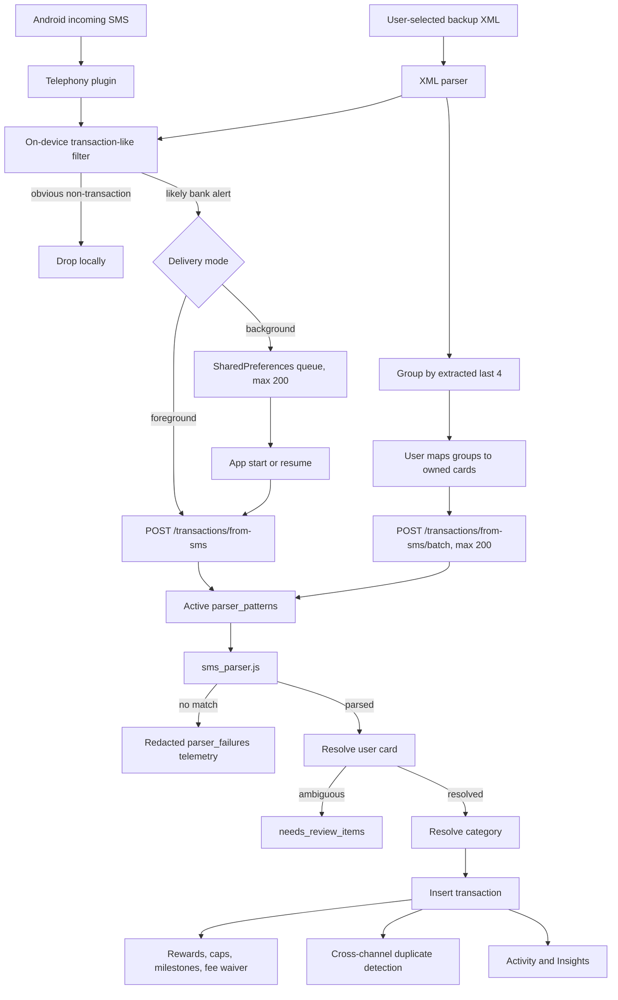
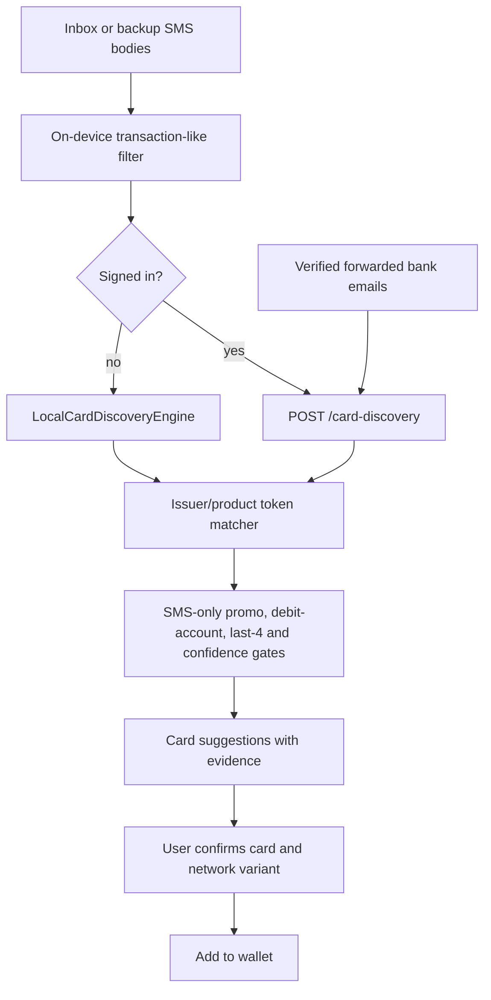

# PandaPay SMS feature: architecture, behavior, and operations

**Status:** Current-state reference
**Last verified:** 2026-09-09
**Code snapshot:** `ca0b863` plus the working tree present during this audit

This is the source of truth for PandaPay's SMS-related features. It describes
what the code does today, what data crosses the network, how an SMS becomes a
transaction, which other features consume that transaction, and what must be
fixed before SMS can be called production-ready.

The older [`smsextractionimple.md`](../smsextractionimple.md) is a historical
implementation plan. It explains why several changes were made, but its status
tables and readiness claims are not reliable descriptions of the current build.

## 1. Executive summary

"The SMS feature" is actually four different features:

1. **Live SMS transaction import** reads newly arriving Android SMS messages,
   filters obvious noise on-device, sends likely bank alerts to the API, and
   attempts to create transactions.
2. **SMS backup import** reads a user-selected XML export, filters and groups it
   on-device, and sends selected messages to a batched transaction-import API.
3. **Card discovery from SMS** searches SMS text for evidence of cards the user
   owns. It suggests cards; it does not create transactions.
4. **Parser operations** lets an administrator maintain the server-side regular
   expressions that turn bank-alert text into amount, merchant, card suffix,
   and date fields.

These share SMS text and some UI, but they do not share one parsing engine.
Card discovery uses product-name and issuer matching. Transaction import uses
the `parser_patterns` database table and `api/src/sms_parser.js`.

### Current production facts

The following was verified directly on 2026-09-09:

| Check | Result |
| --- | --- |
| Production `parser_patterns` rows | **0** |
| Production SMS parser successes | **0** |
| Production SMS transactions | **0** |
| Production parser-failure shapes | **0** |
| Production SMS backup kill switch | **Enabled** |
| `prodRelease` APK declares `READ_SMS` | **Yes — defect** |
| `prodRelease` APK declares `RECEIVE_SMS` | **Yes — defect** |
| Manifest regression script | **Fails against the built APK — defect** |

Consequently, the transaction parser is structurally implemented but cannot
parse any SMS in production. `parseSmsAgainstPatterns([])` always returns
`no_patterns_configured`. Card discovery can still work because it is a
separate matcher and does not use `parser_patterns`.

## 2. Supported paths and prerequisites

| Path | Platform | Account required | SMS permission | Server required | Current state |
| --- | --- | --- | --- | --- | --- |
| Live incoming-SMS transaction import | Android | Yes | `READ_SMS` + `RECEIVE_SMS` | Yes | Implemented, but no production patterns |
| Background incoming-SMS capture | Android | Yes to upload; queue waits otherwise | `RECEIVE_SMS` | On next app open/resume | Implemented with gaps |
| Read existing inbox for card discovery | Android | No | `READ_SMS` | Signed-in: yes; guest: catalogue fetch only | Implemented |
| SMS-backup XML transaction import | Android/iOS where file picker works | Yes | No | Yes | Implemented, but no production patterns |
| SMS-backup XML card discovery | Android/iOS where file picker works | No | No | Signed-in: yes; guest: catalogue fetch only | Implemented |
| Admin parser maintenance | Admin console | Admin | No | Yes | Implemented; production catalogue empty |

Transaction import cannot work in guest mode because
`userCardsRepositoryProvider` is null without an access token. Card discovery
has a guest path that runs `LocalCardDiscoveryEngine` against the downloaded
public catalogue.

## 3. End-to-end architecture

### 3.1 Transaction-import path



### 3.2 Card-discovery path



Card discovery never automatically adds a card. This is intentional: a false
positive would pollute the wallet and every later recommendation.

## 4. Android capture and permission layer

### 4.1 Manifest and flavor behavior

The main Android manifest declares:

- `android.permission.READ_SMS`, for querying existing inbox messages.
- `android.permission.RECEIVE_SMS`, for receiving newly arriving messages.

The comments in `app/android/app/src/prod/AndroidManifest.xml` say the
production flavor strips both permissions. The file currently contains no
`tools:node="remove"` declarations, so the comments are false. Inspection of
the built `app-prod-release.apk` confirmed both permissions are present.

The intended production posture is backup-file import only, with no restricted
SMS permissions. Until the removal declarations and UI gates are restored, the
Play build does not meet that design.

### 4.2 Permission entry points

SMS permission can currently be requested from several places:

- onboarding `PermissionsScreen`;
- onboarding `TrackingSetupScreen`;
- `SmsImportScreen`, after `SmsConsentScreen`;
- `FindCardsScreen`, when it scans the inbox;
- Settings → Privacy & Permissions.

Most of these check only `Platform.isAndroid`, not `!Env.isProd`. Therefore the
production UI exposes controls for the live feature. `FindCardsScreen` can also
request the permission without first displaying `SmsConsentScreen`.

### 4.3 Telephony wrapper

`SmsListenerService` wraps the vendored `telephony` plugin:

- `requestPermissions()` requests the SMS permission group.
- `hasPermissions()` and `isPermanentlyDenied()` inspect Android state.
- `readInboxSmsBodies(limit: 500)` reads newest-first and returns only messages
  passing `looksLikeTransactionSms()`.
- `listenForeground()` registers foreground and background callbacks.
- `flushBackgroundQueue()` retries queued messages later.

The listener is started only when the user taps **Start listening**. There is
no persisted "enabled" setting, explicit stop operation, or app-start listener
registration. The UI can say listening while that screen exists, but the code
does not define a durable, user-controlled service lifecycle.

## 5. On-device filtering and hints

`app/lib/features/sms_import/sms_text_hint.dart` contains two deliberately
small heuristics. Neither is the transaction parser.

### `looksLikeTransactionSms(body)`

This is a high-recall pre-filter. It:

1. rejects a short list of promotional phrases such as `apply now`,
   `pre-approved`, and `lifetime free`;
2. accepts text containing any transaction-like token such as `spent`,
   `debited`, `credited`, `purchase`, `INR`, `Rs.`, or `₹`.

False positives are expected and are left for the server parser. False
negatives are more damaging because they are never uploaded or reviewed. The
current vocabulary is predominantly English and should not be described as
complete coverage of Indian bank alerts.

### `extractLast4Hint(body)`

This extracts one unambiguous four-digit card suffix from forms such as:

- `ending 4321`;
- `Card x4321`;
- `XX4321`;
- `****4321`;
- `a/c no. 4321`.

It returns null when no candidate or multiple distinct candidates exist. It is
used to group a backup and help map messages to cards. The server independently
extracts `last4` using the winning parser pattern.

## 6. Live incoming-SMS flow

### Foreground

1. The user opens `SmsImportScreen`, accepts the consent screen, grants SMS
   permission, and taps **Start listening**.
2. The telephony callback receives `(sender, body)`.
3. `looksLikeTransactionSms()` drops obvious noise.
4. `UserCardsRepository.logTransactionFromSms()` sends sender and body to
   `POST /transactions/from-sms`.
5. The API parses, resolves, and inserts or returns a failure outcome.
6. The screen updates its in-memory log and invalidates wallet/review providers.

The foreground call does not send `occurredAt`. The API therefore uses a date
captured by the parser when valid, otherwise server receipt time. Because
`occurredAt` is absent, the exact `source_key` idempotency hash is also absent.
A repeated foreground callback can therefore insert the same SMS more than
once unless the cross-channel duplicate heuristic happens to catch it—and that
heuristic intentionally ignores same-source rows.

### Background

1. Android invokes top-level `smsBackgroundHandler` in a separate Dart isolate.
2. It registers Flutter plugins, validates sender/body, and applies the local
   pre-filter.
3. It stores sender, raw body, and arrival time in `SharedPreferences`.
4. The queue retains at most 200 messages and drops the oldest when full.
5. `smsBackgroundFlushProvider`, watched by the app router, flushes once at
   startup and on every app resume.
6. A signed-in repository posts each message with its original arrival time.
7. Network/server exceptions keep the message queued; any normal HTTP result
   removes it.

The background upload callback currently treats parsed, duplicate,
needs-review, and unparsed API responses alike as "handled." Therefore an
unparsed background SMS is removed from the local queue after only redacted
admin telemetry is recorded. It is not added to the visible on-device Needs
Review queue.

## 7. SMS backup-file flow

`SmsBackupImportScreen` is the permission-free path intended for production.

1. The user picks an `.xml` file. Files larger than 25 MB are rejected.
2. Bytes are decoded as UTF-8 with malformed-byte tolerance.
3. `parseSmsBackupXml()` accepts the common **SMS Backup & Restore** shape:
   `<smses><sms address="..." body="..." date="epoch-ms"/></smses>`.
4. The parser keeps sender, body, and original timestamp. Seconds-based epoch
   values are also tolerated. Implausible dates become null.
5. The app drops messages that fail `looksLikeTransactionSms()` and messages
   without a usable original timestamp.
6. Remaining messages are grouped by `extractLast4Hint()`.
7. A group is preselected only when exactly one active wallet card has the same
   stored `last4`. The user can change or skip each group.
8. Only groups mapped to a card are queued for import.
9. The app sends chunks of at most 200 to
   `POST /transactions/from-sms/batch` with `backfill: true`.
10. Unparsed messages are copied to the on-device Needs Review queue.
11. Import totals are stored in `sms_import_batches`; wallet, transaction,
    review, and batch providers are refreshed.

Backfill transactions are inserted into history but do not advance the current
cycle's cap, milestone, points, or fee-waiver state. They can still appear in
Activity and analytics that query `transactions` directly.

The UI supports cancellation only between 200-message requests. A request in
flight is allowed to finish.

## 8. Server-side parser engine

### 8.1 Pattern schema

Each `parser_patterns` row contains:

| Column | Purpose |
| --- | --- |
| `issuer_id` | Issuer used as a fallback card-resolution signal |
| `channel` | Must be `sms` for these endpoints |
| `sender_pattern` | Case-insensitive literal substring of the SMS sender ID |
| `regex` | JavaScript regular expression applied to the raw body |
| `field_map` | Capture-group mapping, e.g. `{"amount":1,"last4":2,"merchant":3,"date":4}` |
| `version` | Increased on content edits |
| `is_active` | Enables/disables the pattern |
| `sample_text` | Admin-entered example; use synthetic/redacted text only |
| `success_count` / `failure_count` | Intended parser telemetry |

Recognized fields are `amount`, `merchant`, `last4`, and `date`. Amount is
mandatory and must parse to a positive finite number. Last four must be exactly
four digits. Merchant cannot be empty when mapped. Unknown field-map keys are
ignored for forward compatibility.

### 8.2 Matching algorithm

For each request the API loads all active SMS patterns ordered by `version`
descending. `parseSmsAgainstPatterns()` tries them in order and accepts the
first successful match:

1. validate the pattern and body;
2. check the sender literal substring;
3. compile and execute the JavaScript regex;
4. map configured capture groups;
5. normalize comma-separated amount text;
6. validate required/recognized fields.

There is no explicit priority column. A newer broadly matching pattern can win
before a more specific older pattern. Regexes are admin-controlled but there is
currently no body-length cap or regex-complexity guard, so catastrophic
backtracking is an operational risk.

### 8.3 Date resolution

`parseTransactionDate()` supports:

- `YYYY-MM-DD` or `YYYY/MM/DD`;
- day-first numeric dates such as `03-04-26`, `3/4/2026`, `03.04.26`;
- day-first month names such as `03-Apr-26`;
- month-name-first forms such as `Apr 03, 2026`.

Two-digit years are interpreted as 2000–2099. Impossible or future dates are
rejected. For the single endpoint, a valid body date wins only when the client
did not supply `occurredAt`. Backup import always supplies the XML timestamp,
which remains authoritative.

### 8.4 Parse failure

If no pattern succeeds, the API returns HTTP 200 with `parsed: false`. It calls
the security-definer `pandapay.record_parser_failure()` function with:

- channel `sms`;
- sender identifier;
- `redactSmsShape(body)`, where digits become `#` and multi-letter runs become
  `X`;
- optional app version.

Identical `(channel, sender, redacted shape)` failures are aggregated by
`occurrences`. The table has a check constraint forbidding digits. It is
admin-only and is not the user's Needs Review queue.

## 9. Card and category resolution

After parsing, `importParsedMessage()` resolves the owned card without guessing:

1. an explicit client-supplied `userCardId` wins;
2. otherwise, exactly one active `user_cards.last4` match wins;
3. otherwise, exactly one active card from the pattern's issuer wins;
4. ambiguity produces a server `needs_review_items` row.

Category resolution uses, in order:

1. the user's most common past category for the normalized merchant;
2. a published VPA merchant match;
3. MCC mapping;
4. active `merchant_category_rules` name matching;
5. null/uncategorized.

SMS currently supplies neither VPA nor MCC, so most SMS category matches come
from user history or merchant-name rules.

## 10. Transaction insertion and connected features

A successful live SMS import enters the same transaction/state helper used by
manual entry. This is the central connection from SMS to the rest of PandaPay.

| Connected area | Effect of a live SMS transaction |
| --- | --- |
| `transactions` | Inserts amount, card, merchant, category, date, rail=`unknown`, source=`sms` |
| Activity | Transaction appears in history and detail views |
| Reward estimate | Matching reward rule updates estimated value/points |
| Cap tracking | Advances applicable cap consumption |
| Milestones | Advances qualified spend |
| Fee waiver | Advances waiver-qualified spend and may mark achieved |
| Recommendations | Updated card state changes remaining cap/headroom and ranking |
| Insights | Spend/category/trend/report reads can include the transaction |
| Budgets/subscriptions | Transaction-derived analysis can consume it |
| Notifications | Wallet-state refresh can trigger cap, milestone, fee-waiver, and other checks |
| Duplicate review | Compares same-day, amount-within-₹1 transactions from different sources |

Historical backup rows use `backfill: true`, so the current-cycle state updates
are skipped. Duplicate detection still runs.

High-confidence cross-channel duplicates (amount, date window, and normalized
merchant all match) are automatically merged by ignoring the newly inserted
row. Lower-confidence candidates are placed in `duplicate_candidates` for the
Duplicate Review screen.

## 11. The two incompatible Needs Review queues

There are currently two queues with the same product name:

### On-device queue

- Store: `SharedPreferences`, key `pandapay_app.needs_review_queue_v1`.
- Model/repository: `NeedsReviewRepository`.
- Contains raw sender/body/date.
- Visible in `NeedsReviewScreen`.
- Drives the Needs Review badge and notification.
- Created for unparsed foreground and backup messages.

### Server queue

- Store: PostgreSQL `needs_review_items`.
- Contains raw text and parser suggestions.
- Created when parsing succeeds but card attribution is ambiguous.
- Has no client-facing list/resolve/count API in `api/src/index.js`.
- Is not read by `NeedsReviewScreen` and does not drive its badge.

This split violates the intended "nothing is silently dropped" experience.
The app can tell the user that a parsed message was added to Needs Review while
the visible queue remains empty. It also invalidates a local count provider
that cannot see the server row.

## 12. Data handling and privacy

| Stage | Raw SMS location | Persistence |
| --- | --- | --- |
| Inbox scan | Android SMS provider | Existing OS storage |
| Foreground pre-filter | App memory | Ephemeral |
| Background capture | App `SharedPreferences` | Until handled; max 200 |
| Backup file | App memory after user selection | Screen lifetime |
| Transaction parse request | TLS request to PandaPay API | Request lifetime |
| Successful, card-resolved parse | Not copied into transaction row | Structured transaction persists |
| Parse failure | Redacted shape in `parser_failures` | Aggregated telemetry persists |
| Parsed but card-unresolved | `needs_review_items.raw_text` | **Raw server persistence** |
| On-device Needs Review | App `SharedPreferences` | Until user resolves/dismisses |
| Card discovery request | API memory | Not inserted by `/card-discovery` |

The consent sentence "The message text is never stored on our servers" is not
universally true because `fileForReview()` stores raw text for parsed messages
whose card cannot be resolved. The Data Safety declaration and in-app copy must
describe actual behavior, or the architecture must be changed so the claim
becomes true.

Neither local raw-text queue uses encrypted storage; both rely on the Android
application sandbox around `SharedPreferences`.

## 13. API and database inventory

### User APIs

| API | Purpose |
| --- | --- |
| `POST /transactions/from-sms` | One live/background SMS |
| `POST /transactions/from-sms/batch` | Up to 200 backup messages |
| `POST /card-discovery` | Suggestions from SMS plus verified forwarded email |
| `POST /sms-import-batches` | Record backup import summary |
| `GET /sms-import-batches` | Show prior backup-import status |
| `GET /app-status` | Includes backup-import kill switch |

All transaction/batch APIs require PandaPay authentication.

### Admin APIs

| API | Purpose |
| --- | --- |
| `GET /admin/parser-patterns` | List/filter patterns |
| `POST /admin/parser-patterns` | Create pattern and audit entry |
| `PUT /admin/parser-patterns/:id` | Edit/activate pattern, bump version, audit |
| `DELETE /admin/parser-patterns/:id` | Hard delete with audit history |

### Core tables

- `parser_patterns`
- `parser_failures`
- `transactions` and `transactions.source_key`
- `user_cards.last4`
- `needs_review_items`
- `duplicate_candidates`
- `sms_import_batches`
- `app_status.sms_backup_import_enabled`
- reward/cap/milestone/fee-waiver state and points ledger tables

## 14. Outcome matrix

| Condition | API result | Persistent effect | Visible user effect today |
| --- | --- | --- | --- |
| No active pattern | `200 parsed:false` | Redacted failure shape | Foreground/backup can add local review; background does not |
| Pattern mismatch | `200 parsed:false` | Redacted failure shape | Same as above |
| Parsed, card ambiguous | `200 parsed:true needsReview:true` | Raw server review row | App may say Needs Review, but visible queue cannot fetch it |
| Parsed, exact source key exists | `200 duplicate:true` | No new transaction/state | Shown as skipped where UI handles result |
| Parsed and resolved | `201 parsed:true` | Transaction and downstream effects | Appears after provider refresh |
| Network/server error | Exception | Foreground shows failure; background keeps queue | Retry is manual/next resume |
| Backup row lacks timestamp | Not sent | None | Counted as undated/skipped |
| Backup group not mapped to card | Not sent | None | Skipped by user's mapping choice |

## 15. Parser-pattern operations runbook

No production SMS parsing is possible until this runbook has been completed.

1. Collect **synthetic or explicitly consented and redacted** examples for one
   issuer/template. Never paste a real PAN, name, OTP, or reference number into
   `sample_text`.
2. Write a sender substring narrow enough for that issuer.
3. Write a JavaScript regex with an amount capture and, wherever present,
   merchant, last-four, and date captures.
4. Define `field_map` using one-based regex capture indexes.
5. Add positive and negative cases to `api/test/sms_parser.test.js`.
6. Test wrong senders, malformed values, similar payment-due/promotional text,
   impossible dates, and punctuation/currency variants.
7. Create the pattern as inactive in staging if the operational tooling is
   extended to support that workflow; otherwise validate before creation and
   disable immediately if canaries fail.
8. Verify parsing against the staging endpoint with a non-production account.
9. Activate narrowly, monitor `success_count` and aggregated
   `parser_failures.occurrences`, then expand coverage issuer by issuer.
10. Preserve the old pattern or audit record when replacing behavior. Prefer
    disable-and-create over hard delete when rollback value matters.

Because the engine takes the first match ordered by version, every new pattern
must be tested against samples belonging to existing patterns, not only its own
issuer.

## 16. Verification commands

### Pure parser and API tests

```bash
cd api
node --test test/sms_parser.test.js
npm test
```

### Flutter SMS unit/widget tests

```bash
cd app
flutter test test/features/sms_import
flutter test test/data/sms_backup_xml_parser_test.dart
flutter test test/features/activity/needs_review_screen_test.dart
flutter test test/features/activity/duplicate_review_screen_test.dart
```

### Production manifest guard

```bash
PANDAPAY_API_BASE_URL=https://api.pandapath.site \
PANDAPAY_AUTH_BASE_URL=https://auth.pandapath.site \
  ./scripts/build_app.sh prod appbundle --release

./scripts/check_prod_manifest.sh
```

The final command currently fails because the production bundle contains both
SMS permissions. A release must not be published while it fails.

## 17. Authoritative source map

Use these files when changing or reviewing the feature. The old implementation
plan is not a substitute for these sources.

| Area | Source of truth |
|---|---|
| Android SMS permissions | `app/android/app/src/main/AndroidManifest.xml`, `app/android/app/src/prod/AndroidManifest.xml`, `scripts/check_prod_manifest.sh` |
| Foreground and background SMS capture | `app/lib/features/sms_import/sms_listener_service.dart` |
| Background persistence and flush | `app/lib/features/sms_import/sms_background_queue.dart` and its providers |
| Device-side transaction pre-filter and last-four hint | `app/lib/features/sms_import/sms_text_hint.dart` |
| Live-import consent and controls | `app/lib/features/sms_import/sms_consent_screen.dart`, `app/lib/features/sms_import/sms_import_screen.dart` |
| Backup XML parsing and upload | `app/lib/data/sms_backup_xml_parser.dart`, `app/lib/features/sms_import/sms_backup_import_screen.dart` |
| Local Needs Review queue | `app/lib/data/needs_review_repository.dart`, `app/lib/features/activity/needs_review_screen.dart` |
| Duplicate review UI | `app/lib/features/activity/duplicate_review_screen.dart` |
| Card discovery | `app/lib/data/card_discovery_engine.dart`, `api/src/card_discovery.js` |
| SMS transaction parser | `api/src/sms_parser.js` |
| Card/category resolution and import state | `api/src/import_resolvers.js`, `api/src/reward_math.js` |
| SMS and admin endpoints | `api/src/index.js` |
| Parser-pattern console | `console/lib/features/parser_patterns/parser_patterns_screen.dart`, `console/lib/data/admin_api.dart` |
| Parser and review schema | `db/supabase/migrations/0006_ingest.sql`, `db/supabase/migrations/0033_parser_failure_ingest.sql`, `db/supabase/migrations/0039_import_card_matching_and_categorization.sql` |
| Focused regression tests | `api/test/sms_parser.test.js`, `app/test/features/sms_import/`, `app/test/data/sms_backup_xml_parser_test.dart`, `app/test/data/needs_review_repository_test.dart`, `app/test/features/activity/needs_review_screen_test.dart`, `app/test/features/activity/duplicate_review_screen_test.dart` |

## 18. Known defects and recommended order

### P0 — blocks a truthful production launch

1. **Seed and validate parser coverage.** Production has no patterns, so every
   transaction parse fails.
2. **Remove SMS permissions from `prodRelease`.** Restore explicit
   `tools:node="remove"` entries and keep the manifest guard mandatory.
3. **Hide live-SMS UI in prod.** Gate every live/inbox permission entry point
   with one shared capability, not scattered `Platform.isAndroid` checks.
4. **Correct consent and Data Safety language.** Either stop storing raw text
   in server review rows or disclose that narrowly defined retention.

### P1 — correctness and user trust

5. **Unify Needs Review.** Build authenticated list/resolve/count APIs and use
   one repository, or keep all raw review data local and return enough parsed
   fields for the client to create it locally.
6. **Do not discard background parse misses.** Preserve them in the visible
   review queue until the user resolves or dismisses them.
7. **Make live import idempotent.** Pass a stable SMS timestamp/identity for
   foreground messages too.
8. **Define listener lifecycle.** Persist enabled state, register on app start,
   provide a real stop switch, and expose current status accurately.
9. **Refresh all consumers.** Live/background imports should invalidate
   transactions, Activity-derived providers, review counts, and relevant
   analytics—not only wallet state.

### P2 — resilience and coverage

10. Add body-length and regex-complexity/time guards.
11. Expand the local pre-filter with measured multilingual/template coverage.
12. Encrypt local raw-message queues or explicitly accept/document the app
    sandbox risk.
13. Make parser-failure telemetry actionable in the console, including a
    reviewed/fixed workflow and trustworthy per-pattern failure metrics.
14. Add Android instrumentation coverage for real broadcast delivery,
    permission denial, process death, resume flush, and duplicate callbacks.

## 19. Definition of production-ready

The SMS feature is production-ready only when all of these are true:

- the production manifest guard passes and the Play APK/AAB contains no SMS
  permissions unless PandaPay has an approved, documented policy basis;
- production has a versioned parser-pattern baseline with canary tests;
- representative issuer templates parse with correct amount, card, merchant,
  category, and date;
- duplicate delivery and repeated backup import are idempotent;
- every failure is visible in one user-accessible review queue;
- consent copy exactly matches transmission and retention behavior;
- live import is hidden where unsupported and backup import remains available;
- background capture survives offline/resume without silently losing messages;
- downstream Activity, reward, cap, milestone, fee-waiver, Insights, duplicate,
  and notification behavior has integration coverage;
- production aggregate monitoring can report pattern coverage, successes,
  failure shapes, unresolved review items, and imported transaction counts.
# Implementation update

The shared transaction ingestion and count-once fixes are documented in [Transaction ingestion, provenance, and count-once behavior](transaction-ingestion-and-deduplication.md). That document supersedes any statement here that cross-source duplicates remain active, that foreground/background SMS use upload time, or that an empty `parser_patterns` table makes every eligible card-spend message unparseable.
